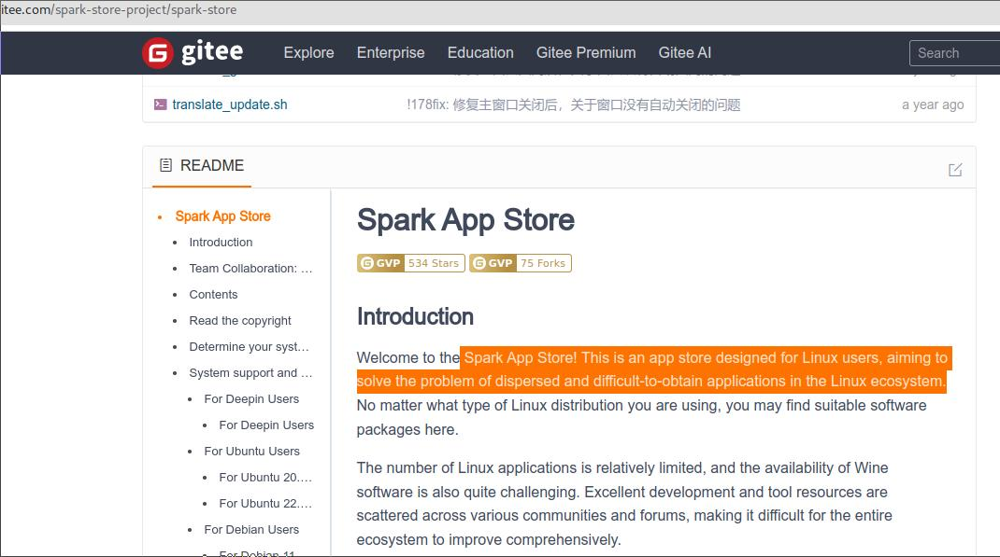
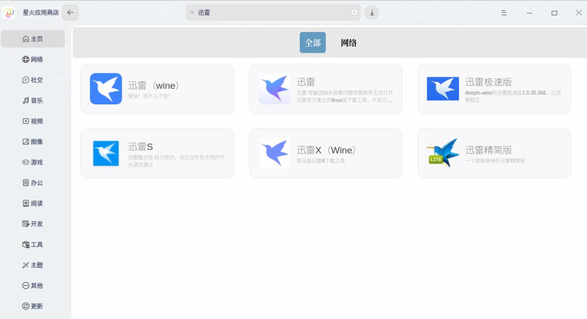

# How to Install/Use Spark App Store On Ubuntu22.04

---

## What is Spark App Store?

-  Spark App Store is an app store designed for Linux users, aiming to solve the problem of dispersed and difficult-to-obtain applications in the Linux ecosystem.
-  `https://gitee.com/spark-store-project/spark-store`



---

## How to Install Spark App Store
Install:   

```
wget https://gitee.com/spark-store-project/spark-store/releases/download/4.2.11/spark-store_4.2.11_amd64.deb
sudo apt install ./spark-store_4.2.11_amd64.deb
```
---

## How to use Spark App Store
- Take LXQt for example, (`Startup->System Tools-> Spark App Store`)


---

# How to Install App
- Take Xunlei for example: 



---

# Thanks!
