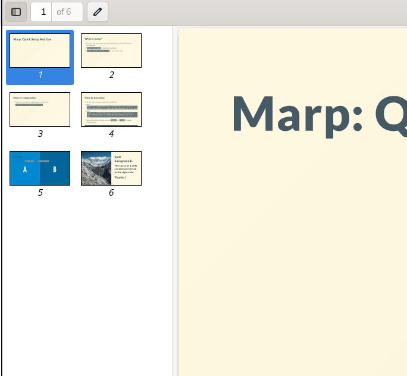
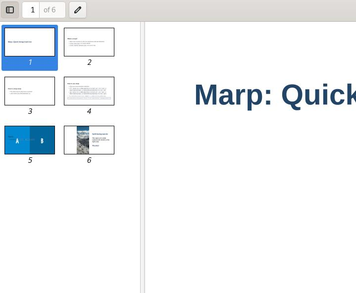

# Marp: Quick Setup And Use

---

## What is marp?

- Marp is the ecosystem to write your presentation with plain Markdown.
- `https://marp.app/` is its official website
- `https://github.com/marp-team` is its source code

---

## How to setup marp

- The easiest way for using marp is via docker
- `sudo docker pull marpteam/marp-cli`

---

## How to use marp

- Write your own presentation markdown
- PDF: `docker run -e MARP_USER="$(id -u):$(id -g)" --rm --init -v $PWD:/home/marp/app/ -e LANG=$LANG marpteam/marp-cli 1.md --pdf`
- pptx: `docker run -e MARP_USER="$(id -u):$(id -g)" --rm --init -v $PWD:/home/marp/app/ -e LANG=$LANG marpteam/marp-cli 1.md --pptx`

> You could write an alias in your `.bashrc` or `.zshrc` for easy calling marp:   

```
alias mymarp='docker run -e MARP_USER="$(id -u):$(id -g)" --rm --init -v $PWD:/home/marp/app/ -e LANG=$LANG marpteam/marp-cli'
```
---




# Theme gaia

- Generated via `mymarp --theme gaia HowtoMarp.md --allow-local-files --pdf`
---


# Theme default

- Generated via `mymarp --theme default HowtoMarp.md --allow-local-files --pdf`
---

# Thanks!
